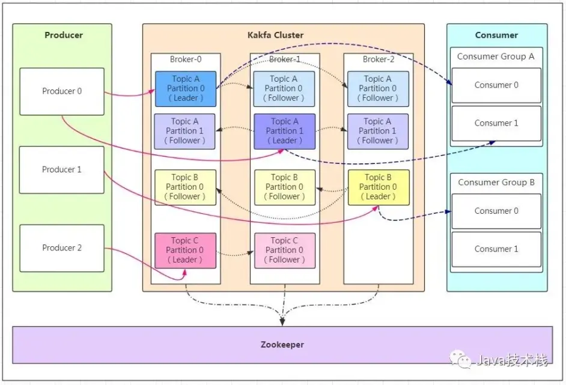

# kafka

# 一、基础

## 1.1 概念

Apache kafka是消息中间件的一种，在本质上来讲，Kafka并不是一个消息队列，它实际上是用来做流处理的一个平台

- 白话文

    生产者生产鸡蛋，消费者消费鸡蛋，生产者生产一个鸡蛋，消费者就消费一个鸡蛋，假设消费者消费鸡蛋的时候噎住了（系统宕机了），生产者还在生产鸡蛋，那新生产的鸡蛋就丢失了。再比如生产者很强劲（大交易量的情况），生产者1秒钟生产100个鸡蛋，消费者1秒钟只能吃50个鸡蛋，那要不了一会，消费者就吃不消了（消息堵塞，最终导致系统超时），消费者拒绝再吃了，”鸡蛋“又丢失了，这个时候我们放个篮子在它们中间，生产出来的鸡蛋都放到篮子里，消费者去篮子里拿鸡蛋，这样鸡蛋就不会丢失了，都在篮子里，而这个篮子就是”kafka“

## 1.2 名词解释



- `Producer`：生产者，消息的产生者，是消息的入口。
- `kafka cluster`：**Broker**是kafka实例，每个服务器上有一个或多个kafka的实例，我们姑且认为每个broker对应一台服务器。每个kafka集群内的broker都有一个不重复的编号，如图中的broker-0、broker-1等……
- `Topic`：消息的主题，可以理解为消息的分类，kafka的数据就保存在topic。在每个broker上都可以创建多个topic。
- `Partition`：Topic的分区，每个topic可以有多个分区，分区的作用是做负载，提高kafka的吞吐量。同一个topic在不同的分区的数据是不重复的，partition的表现形式就是一个一个的文件夹
- `Replication`：每一个分区都有多个副本，副本的作用是做备胎。当主分区（Leader）故障的时候会选择一个备胎（Follower）上位，成为Leader。在kafka中默认副本的最大数量是10个，且副本的数量不能大于Broker的数量，follower和leader绝对是在不同的机器，同一机器对同一个分区也只可能存放一个副本（包括自己）。
- `Message`：每一条发送的消息主体。
- `Consumer`：消费者，即消息的消费方，是消息的出口。
- `Consumer Group`：我们可以将多个消费组组成一个消费者组，在kafka的设计中同一个分区的数据只能被消费者组中的某一个消费者消费。同一个消费者组的消费者可以消费同一个topic的不同分区的数据，这也是为了提高kafka的吞吐量！
- `Zookeeper`：kafka集群依赖zookeeper来保存集群的的元信息，来保证系统的可用性

## 1.3 需要知道的原理

- kafka节点之间如何复制备份的？
- kafka消息是否会丢失？为什么？
- kafka最合理的配置是什么？
- kafka的leader选举机制是什么？
- kafka对硬件的配置有什么要求？
- kafka的消息保证有几种方式？
- kafka为什么会丢消息？

# 二、入门

## 2.1 **概念：**

1. kafka作为一个集群运行在一个或多个服务器上。
2. kafka集群存储的消息是以topic为类别记录的。
3. 每个消息（也叫记录record，我习惯叫消息）是由一个key，一个value和时间戳构成

## 2.2 工作流程：


```markdown
    1.⽣产者从Kafka集群获取分区leader信息
    2.⽣产者将消息发送给leader
    3.leader将消息写入本地磁盘
    4.follower从leader拉取消息数据
    5.follower将消息写入本地磁盘后向leader发送ACK
    6.leader收到所有的follower的ACK之后向生产者发送ACK
```

## 2.3 选择partition的原则

在kafka中，如果某个topic有多个partition，producer发送数据选择partition的几个原则：

1. partition在写入的时候可以指定需要写入的partition，如果有指定，则写入对应的partition。
2. 如果没有指定partition，但是设置了数据的key，则会根据key的值hash出一个partition。
3. 如果既没指定partition，又没有设置key，则会采用轮询⽅式，即每次取一小段时间的数据写入某个partition，下一小段的时间写入下一个partition

## 2.4 ACK应答机制

producer在向kafka写入消息的时候，可以设置参数来确定是否确认kafka接收到数据，这个参数可设置 的值为 0,1,all

- 0代表producer往集群发送数据不需要等到集群的返回，不确保消息发送成功。安全性最低但是效 率最高。
- 1代表producer往集群发送数据只要leader应答就可以发送下一条，只确保leader发送成功。
- all代表producer往集群发送数据需要所有的follower都完成从leader的同步才会发送下一条，确保 leader发送成功和所有的副本都完成备份。安全性最⾼高，但是效率最低。

最后要注意的是，如果往不存在的topic写数据，kafka会⾃动创建topic，partition和replication的数量 默认配置都是1

## 2.5 主题和日志 （Topic和Log）

Topic是发布的消息的类别名，一个topic可以有零个，一个或多个消费者订阅该主题的消息。

对于每个topic，Kafka集群都会维护一个分区log，就像下图中所示：

每一个分区都是一个顺序的、不可变的消息队列， 并且可以持续的添加。分区中的消息都被分了一个序列号，称之为偏移量(offset)，在每个分区中此偏移量都是唯一的。


Kafka集群保持所有的消息，直到它们过期（无论消息是否被消费）。实际上消费者所持有的仅有的元数据就是这个offset（偏移量），也就是说offset由消费者来控制：正常情况当消费者消费消息的时候，偏移量也线性的的增加。但是实际偏移量由消费者控制，消费者可以将偏移量重置为更早的位置，重新读取消息。可以看到这种设计对消费者来说操作自如，一个消费者的操作不会影响其它消费者对此log的处理。


再说说分区。Kafka中采用分区的设计有几个目的。一是可以处理更多的消息，不受单台服务器的限制。Topic拥有多个分区意味着它可以不受限的处理更多的数据。第二，分区可以作为并行处理的单元

## 2.5 分布式(Distribution)

Log的分区被分布到集群中的多个服务器上。每个服务器处理它分到的分区。 根据配置每个分区还可以复制到其它服务器作为备份容错。 每个分区有一个leader，零或多个follower。Leader处理此分区的所有的读写请求，而follower被动的复制数据。如果leader宕机，其它的一个follower会被推举为新的leader。 一台服务器可能同时是一个分区的leader，另一个分区的follower。 这样可以平衡负载，避免所有的请求都只让一台或者某几台服务器处理

## 2.5 Geo-Replication(异地数据同步技术)

Kafka MirrorMaker为群集提供geo-replication支持。借助MirrorMaker，消息可以跨多个数据中心或云区域进行复制。 您可以在active/passive场景中用于备份和恢复; 或者在active/passive方案中将数据置于更接近用户的位置，或数据本地化

## 2.6 生产者(Producers)

生产者往某个Topic上发布消息。生产者也负责选择发布到Topic上的哪一个分区。最简单的方式从分区列表中轮流选择。也可以根据某种算法依照权重选择分区。开发者负责如何选择分区的算法

## 2.7 消费者(Consumers)

通常来讲，消息模型可以分为两种， 队列和发布-订阅式。 队列的处理方式是 一组消费者从服务器读取消息，一条消息只有其中的一个消费者来处理。在发布-订阅模型中，消息被广播给所有的消费者，接收到消息的消费者都可以处理此消息。Kafka为这两种模型提供了单一的消费者抽象模型： 消费者组 （consumer group）。 消费者用一个消费者组名标记自己。 一个发布在Topic上消息被分发给此消费者组中的一个消费者。 假如所有的消费者都在一个组中，那么这就变成了queue模型。 假如所有的消费者都在不同的组中，那么就完全变成了发布-订阅模型。 更通用的， 我们可以创建一些消费者组作为逻辑上的订阅者。每个组包含数目不等的消费者， 一个组内多个消费者可以用来扩展性能和容错。正如下图所示：


2个kafka集群托管4个分区（P0-P3），2个消费者组，消费组A有2个消费者实例，消费组B有4个。

正像传统的消息系统一样，Kafka保证消息的顺序不变。 再详细扯几句。传统的队列模型保持消息，并且保证它们的先后顺序不变。但是， 尽管服务器保证了消息的顺序，消息还是异步的发送给各个消费者，消费者收到消息的先后顺序不能保证了。这也意味着并行消费将不能保证消息的先后顺序。用过传统的消息系统的同学肯定清楚，消息的顺序处理很让人头痛。如果只让一个消费者处理消息，又违背了并行处理的初衷。 在这一点上Kafka做的更好，尽管并没有完全解决上述问题。 Kafka采用了一种分而治之的策略：分区。 因为Topic分区中消息只能由消费者组中的唯一一个消费者处理，所以消息肯定是按照先后顺序进行处理的。但是它也仅仅是保证Topic的一个分区顺序处理，不能保证跨分区的消息先后处理顺序。 所以，如果你想要顺序的处理Topic的所有消息，那就只提供一个分区。

## 2.8 Kafka的保证(Guarantees)

- 生产者发送到一个特定的Topic的分区上，消息将会按照它们发送的顺序依次加入，也就是说，如果一个消息M1和M2使用相同的producer发送，M1先发送，那么M1将比M2的offset低，并且优先的出现在日志中。
- 消费者收到的消息也是此顺序。
- 如果一个Topic配置了复制因子（replication factor）为N， 那么可以允许N-1服务器宕机而不丢失任何已经提交（committed）的消息。

## 2.9 kafka作为一个消息系统

### Kafka的流与传统企业消息系统相比的概念如何？

传统的消息有两种模式：`队列`和`发布订阅`。 在队列模式中，消费者池从服务器读取消息（每个消息只被其中一个读取）; 发布订阅模式：消息广播给所有的消费者。这两种模式都有优缺点，队列的优点是允许多个消费者瓜分处理数据，这样可以扩展处理。但是，队列不像多个订阅者，一旦消息者进程读取后故障了，那么消息就丢了。而`发布和订阅`允许你广播数据到多个消费者，由于每个订阅者都订阅了消息，所以没办法缩放处理。

kafka中消费者组有两个概念：`队列`：消费者组（consumer group）允许同名的消费者组成员瓜分处理。`发布订阅`：允许你广播消息给多个消费者组（不同名）。

kafka的每个topic都具有这两种模式。

### kafka有比传统的消息系统更强的顺序保证。

传统的消息系统按顺序保存数据，如果多个消费者从队列消费，则服务器按存储的顺序发送消息，但是，尽管服务器按顺序发送，消息异步传递到消费者，因此消息可能乱序到达消费者。这意味着消息存在并行消费的情况，顺序就无法保证。消息系统常常通过仅设1个消费者来解决这个问题，但是这意味着没用到并行处理。

kafka做的更好。通过并行topic的parition —— kafka提供了顺序保证和负载均衡。每个partition仅由同一个消费者组中的一个消费者消费到。并确保消费者是该partition的唯一消费者，并按顺序消费数据。每个topic有多个分区，则需要对多个消费者做负载均衡，但请注意，`相同的消费者组中不能有比分区更多的消费者，否则多出的消费者一直处于空等待，不会收到消息`

## 2.10 kafka作为一个存储系统

所有发布消息到`消息队列`和消费分离的系统，实际上都充当了一个存储系统（发布的消息先存储起来）。Kafka比别的系统的优势是它是一个非常高性能的`存储系统`。

写入到kafka的数据将写到磁盘并复制到集群中保证容错性。并允许生产者等待消息应答，直到消息完全写入。

kafka的磁盘结构 - 无论你服务器上有50KB或50TB，执行是相同的。

client来控制读取数据的位置。你还可以认为kafka是一种专用于高性能，低延迟，提交日志存储，复制，和传播特殊用途的`分布式文件系统`。

## 2.11 kafka的流处理

仅仅读，写和存储是不够的，kafka的目标是实时的流处理。

在kafka中，流处理持续获取`输入topic`的数据，进行处理加工，然后写入`输出topic`。例如，一个零售APP，接收销售和出货的`输入流`，统计数量或调整价格后输出。

可以直接使用producer和consumer API进行简单的处理。对于复杂的转换，Kafka提供了更强大的Streams API。可构建`聚合计算`或`连接流到一起`的复杂应用程序。

助于解决此类应用面临的硬性问题：处理无序的数据，代码更改的再处理，执行状态计算等。

Sterams API在Kafka中的核心：使用producer和consumer API作为输入，利用Kafka做状态存储，使用相同的组机制在stream处理器实例之间进行容错保障